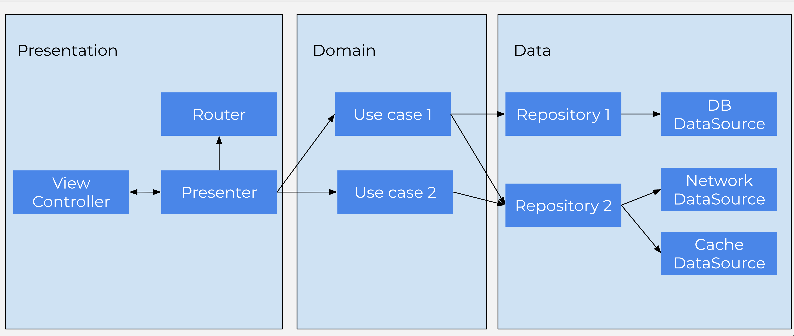

# Cabify Mobile Challenge

Besides providing exceptional transportation services, Cabify also runs a physical store which sells Products.

Our list of products looks like this:

``` 
Code         | Name                |  Price
-------------------------------------------------
VOUCHER      | Cabify Voucher      |   5.00€
TSHIRT       | Cabify T-Shirt      |  20.00€
MUG          | Cabify Coffee Mug   |   7.50€
```

Various departments have insisted on the following discounts:

 * The marketing department believes in 2-for-1 promotions (buy two of the same product, get one free), and would like to have a 2-for-1 special on `VOUCHER` items.

 * The CFO insists that the best way to increase sales is with discounts on bulk purchases (buying x or more of a product, the price of that product is reduced), and demands that if you buy 3 or more `TSHIRT` items, the price per unit should be 19.00€.

Cabify's checkout process allows for items to be scanned in any order, and should return the total amount to be paid.

Examples:

    Items: VOUCHER, TSHIRT, MUG
    Total: 32.50€

    Items: VOUCHER, TSHIRT, VOUCHER
    Total: 25.00€

    Items: TSHIRT, TSHIRT, TSHIRT, VOUCHER, TSHIRT
    Total: 81.00€

    Items: VOUCHER, TSHIRT, VOUCHER, VOUCHER, MUG, TSHIRT, TSHIRT
    Total: 74.50€


# To do
- Implement an app where a user can pick products from a list and checkout them to get the resulting price. No need to implement any real payment system, just a fake feedback about the payment has been completed.
- The discounts can change in the future, depending on the year season we apply different ones.
- There is no need for a user login screen.
- We would like to show users what discounts have been applied in their purchase. 
- You should get the list of products from [here](https://api.myjson.com/bins/4bwec).

## Bonus
- The app should work also offline, and all that this implies. 

**The code should:**
- Be written as production-ready code. You will write production code. We would like you to build it in the same way as if you were going to publish to the store.
- Be easy to grow and easy to add new functionality.
- Have notes attached, explaning the solution and why certain things are included and others are left out.
- Be written either in Swift or Kotlin, preferably in the latest stable version of the language.

# Architecture

A customized version of VIPER is used as arquitecture pattern. The project is divided in the next layers:

-**Presentation**: The presentation folder contains all the classes to implement the presentation logic using MVP pattern.

-**Domain**: In this layer, we found the business logic of the app implemented using use cases.

-**Data**: The third layer is meant to provide access to the all the data of the app. It follows the repository pattern. Each repository give access to the data of a logical entity (for example, `UserRepository` for `User` entity). The repository sync one or more data sources (for example, `RemoteDataSource` and `LocalDataSource`)



# Setup

The project uses `Cocoapods` as dependency manager. In order to set up the project runs `pod install`. Then open `CabifyMobileChallenge.xcworkspace` file

# Localization

All strings used in the app are localized using NSLocalized API.

# Testing

In order to test the app, some UI tests are added. The following dependencies are used:

- KIF:  iOS integration test framework. Allows to test UI
- Cuckoo: Generate mocks automatically

To tests all the cases, Data Layer (Repositories) is mocked. In this way, a single test can cover:

- ViewController
- Presenter
- Use cases


# Error management

As we perform a network request to retrieve the list of the products, errors must be managed:

`CustomError` enum contains two errors:
- `NoInternetConnection`: If there is no Internet connection
- `Unknown`: For another type of errors


# Design decisions

## Discounts

In order to easily adds discounts, a protocol `Discount` is defined. I have decided that only one discount can be applied to each product, to avoid conflicts while applying two different discounts to one product.

A `HardcodedDiscountDatasource` is created to provide the discounts. New discounts can be easily added by modifiying it. In the future, the discounts could be obtained from a remote endpoint by using the `URLRemoteDataSource` 


## Shopping Cart

Shopping cart is modeled as a dictionary with `Product` as key and the quantity as value. Performance of this data structure is O(1)

In `ShoppingCartViewController` we show the discounts although the discounted amount is zero. In this way, user can know what discounts can be applied to the products.

# Improvements

- Specify a CI/CD pipeline to test and deliver the app automatically.
- Test URLRemoteDataSource using https://github.com/AliSoftware/OHHTTPStubs or similar.
- Add tests for repositories. I haven't add it because don't have so much logic.
- Offline storage of product list and shopping cart.


